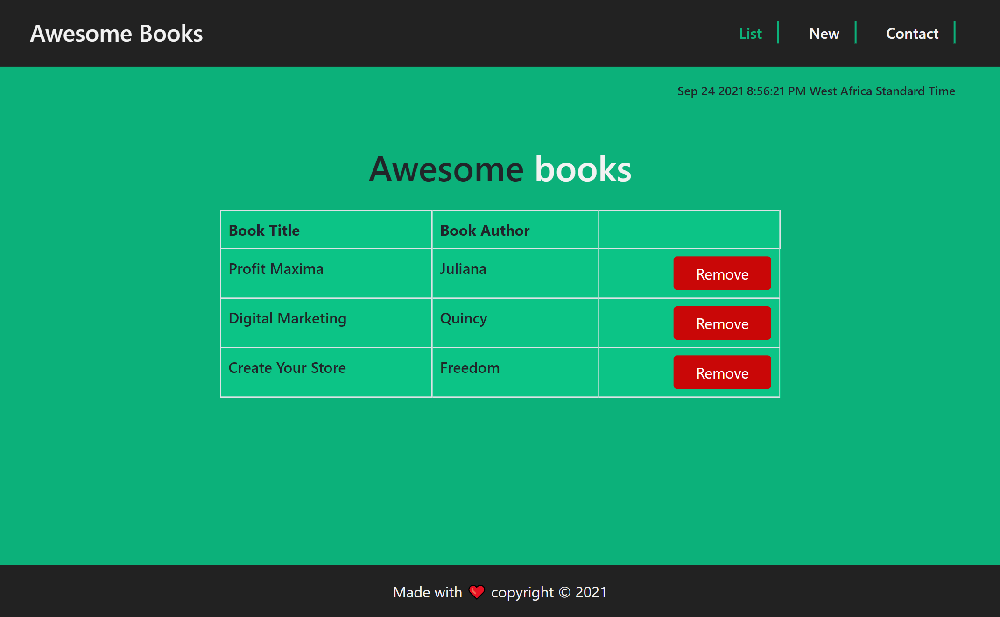
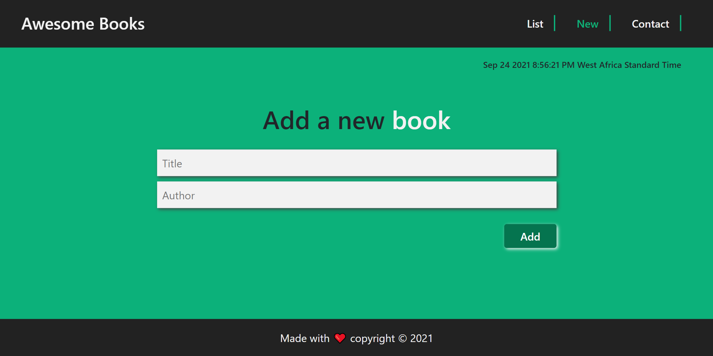

###  Book-store
---
Assigment from Microverse: Awesome Books store;

## Description

- This project is about a book-store where user can store the title and author of thier favourite books, and can also remove books, 

## Built With

This project is build with:
- HTML
- CSS
- JAVASCRIPT

## LIVE DEMO;
---
here is the live link: [Live Demo](https://julie-ify.github.io/Book-Store/)

## Getting Started;
---

To get the content of this project locally you need to run this command in your terminal:

- ` git clone https://https://github.com/julie-ify/Book-Store.git`

For tracking linter errors locally you need to follow these steps:

- After cloning the project you need to run this command

  > `npm install`
  > This command will download all the dependancies 

- For tracking the linter errors in HTML file run:

  > `npx hint .`

- And for tracking the linter errors in CSS file run:
  > `npx stylelint "\*_/_.{css,scss}"`

## Author

👤 **Isaac Lumato**

- GitHub: [Isaac Lumato](https://github.com/isaka-lumato)
- Twitter: [Isaac Lumato](https://twitter.com/lm10skilly)
- LinkedIn: [Isaac Lumato](https://www.linkedin.com/in/isaka-william-90773020b/)

👤 **Juliana Ifionu** 💖

- Github:[Juliana Ifionu](https://github.com/julie-ify)
- Linkedin: [Juliana Ifionu](https://www.linkedin.com/in/juliana-ifionu-4a9492212/)

## :handshake: Contributing

Feel free to check the [issues page](https://github.com/julie-ify/Book-Store/issues)

## Show your support

Give a :star: if you like this project!

## Acknowledgments

- Thanks to [Microverse](www.microverse.org) team that help with the tamplete of this project
- Thanks to everyone who will get time to check this code especially to code reviewers.

## 📝 License

This project is [MIT](./MIT.md) licensed.